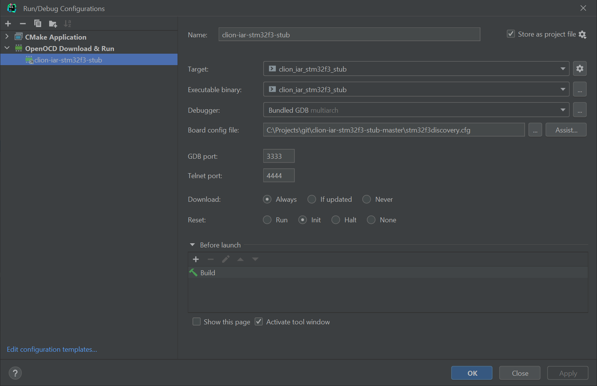

# Preface

We use STM32CubeMX because it’s very easy to use and provides HAL and startup code.  
If you do not use an STM32 or want to use STM32CubeMX just skip the Create a Project stage and write your own startup code.

# Prerequisites

* CLion 2022.2.3
* Stm32CubeMX 6.6.1
* CMake 3.24.2
* IAR Embedded Workbench for ARM 9.30.1 (with license)
* STM32F3-Discovery
* OpenOCD

# Create a Project

Start Stm32CubeMX, open board selector, STM32F3-Discovery, and create the project. Important changes: 

Then generate the project.

# Clion Toolchains Settings

1. In CLion, navigate to Settings | Build, Execution, Deployment | Toolchains  
   On Windows, create a new MinGW toolchain or select an existing one. Use bundled MinGW and CMake or configure the path to your installation.

2. Select the debugger: you can use the bundled GDB or a custom GDB version, for example, the debugger from GNU ARM Embedded Toolchain.

# CLion CMake Settings

1. Open the project in CLion (ignore CMake errors).
2. Configure [CMakeLists.txt](CMakeLists.txt) for your project.
3. Configure [toolchain-iar-9-arm.cmake](toolchain-iar-9-arm.cmake) to match your IAR installation path.  
`set(IAR_TOOLCHAIN_ROOT "C:/Program Files/IAR Systems/Embedded Workbench 9.0/arm")`
4. Configure [CMakePresets.json](CMakePresets.json) to use the toolchain created earlier.`"toolchain": "CMake 3.24"`
5. Right-click _CMakeLists.txt_ in the project tree and click _Load CMake Project_
6. In CLion, navigate to Settings | Build, Execution, Deployment | CMake and enable the `Default preset` profile
   
7. Add your code to `main()` and `cppMain` functions

Alternative to steps 4 - 6:
In CLion, navigate to Settings | Build, Execution, Deployment | CMake  
Create a new profile or select an existing one and Under `CMake options:` add:  
`-DCMAKE_TOOLCHAIN_FILE=$CMakeProjectDir$/toolchain-iar-9-arm.cmake`

# Debug

1. Open _Run Configurations_
    1. Drop existing one(s)
    2. Create _OpenOCD Download & Run_
    3. Click “Assist”, find your board, or closest to your config
    4. Click “Copy to Project & Use”  
        
    5. Open OpenOCD config file and add to the very end  
2. (Optional) Enable semi-hosting via [.gdbinit](.gdbinit)
3. Set breakpoint to the very beginning of main()
4. Click debug button
5. Wait
6. Debugger works
7. Enjoy!

