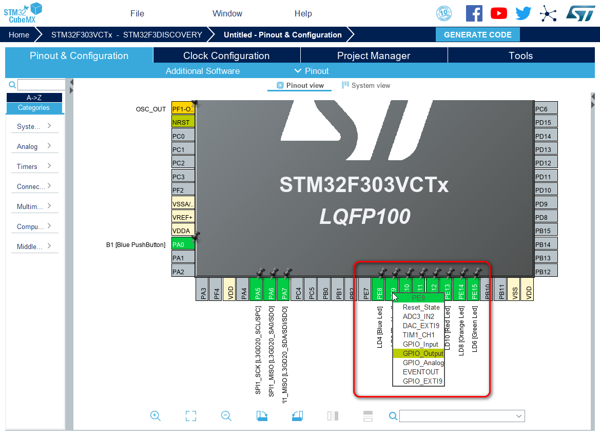
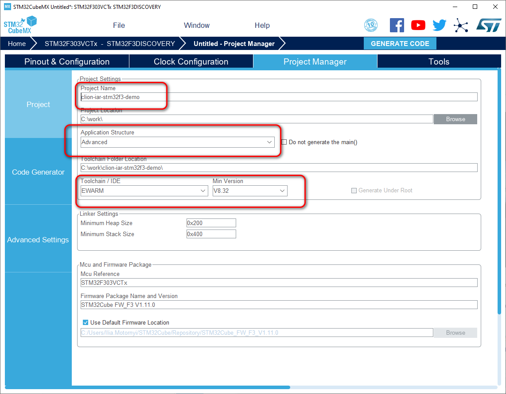
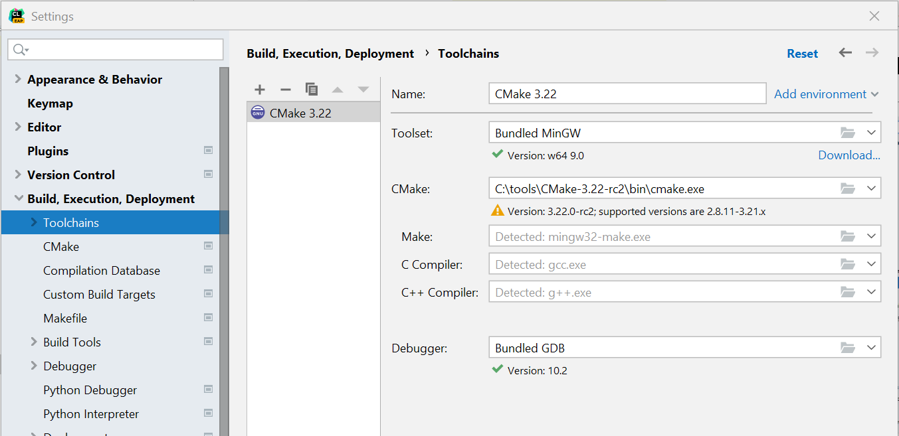
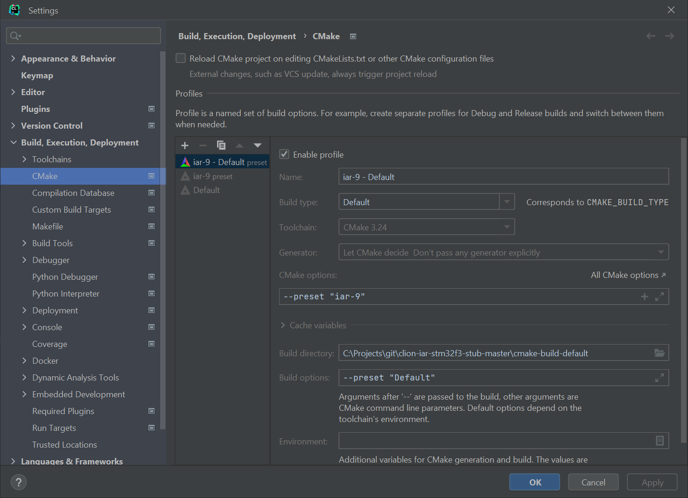
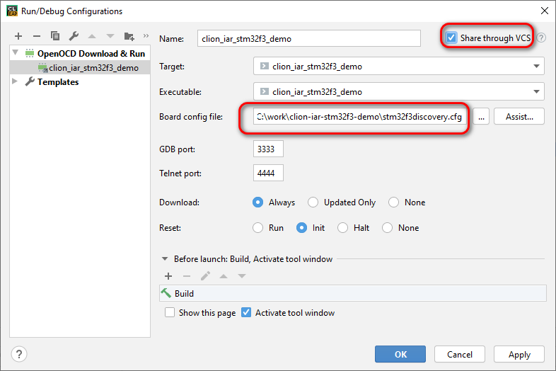

# Preface

We use STM32CubeMX because it’s very simple to use.   \
If it’s not used(i.e. you do not use that or your chip is not STM32), just skip stage I and write your own startup code.

# Prerequisites

*   Windows 7+
*   Stm32CubeMX
*   IAR Embedded WorkBench for ARM with a license
*   MinGW installed
*   STM32F3-Discovery
*   OpenOCD 

# Create a project

Start Stm32CubeMX, open board selector, STM32F3-Discovery, and create the project. Important changes: 

Then generate the project

# Clion Build settings

# CLion project adjustments

g1. Add empty CMakeLists.txt to the project
2. Open the project in CLion (ignore CMake errors reported)
4. Write CMakeLists.txt [CMakeLists.txt](CMakeLists.txt)
5. Add your code to the main() function
6. Reset CMake caches

# Debug

1. Open _Run Configurations_
    1. Drop existing one(s)
    2. Create _OpenOCD Download & Run_
    3. Click “Assist”, find your board, or closest to your config
    4. Click “Copy to Project & Use” \
        
    5. Open OpenOCD config file and add to the very end \
2. Set breakpoint to the very beginning of main()
3. Click debug button
4. Wait a bit
5. Debugger works
7. Enjoy!

# Add C++ code

There is a [pull request](https://github.com/elmot/clion-iar-stm32f3-stub/pull/2) 
with necessary changes and a small example
